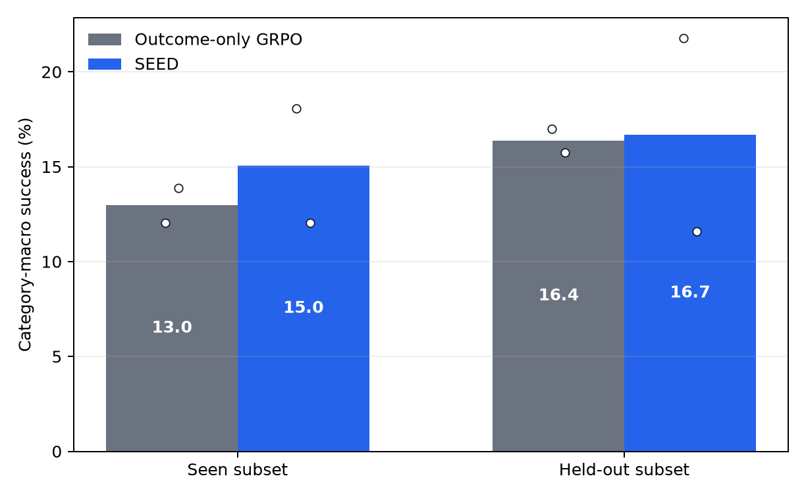
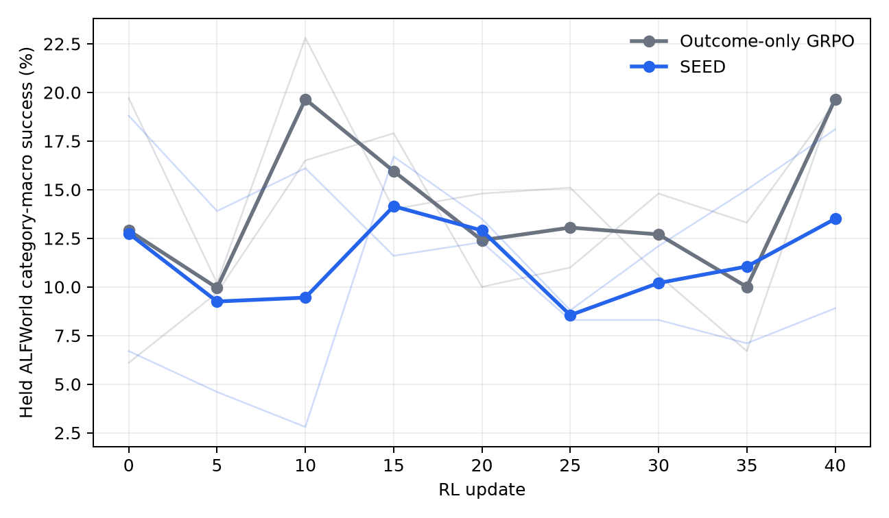

# Does SEED improve a small ALFWorld agent?

**Verdict: partially reproduced.** Across two matched Qwen3-1.7B training seeds, confidence-gated skill-induced on-policy distillation improved mean fixed final ALFWorld category-macro success by **2.1 points on seen tasks** and **0.3 points on held-out tasks**. These means have the paper's direction but are much smaller, and both effects reverse on the second seed. SEED also had lower mean validation macro-AUC than outcome-only GRPO. All measured evidence came from Kubernetes runs on NVIDIA RTX PRO 6000 Blackwell GPUs, with 16 GPUs allocated concurrently at peak and **7.480803 hours** of total chronological experiment wall time.

[Open the self-contained notebook directly in Molab](https://molab.marimo.io/github/alphaXiv/seed-self-evolving-on-policy-distillation-for-ag/blob/main/notebooks/seed_reproduction.py).

## Central question

SEED addresses a hard feature of agentic reinforcement learning: a long trajectory may receive only one outcome reward, even though many individual action tokens determine success. The method has the current policy analyze its own trajectory into a hindsight skill. It then asks how much that skill raises the likelihood of each sampled token and distills only where that shift clears a confidence gate. The skill is training-only; deployment uses the ordinary policy.

The paper reports that, for Qwen2.5-3B on ALFWorld, outcome-only GRPO reaches **75.0%** category-macro success while SEED reaches **91.8%**, a **+16.8-point** gain. It also reports a **+15.3-point** average effect on held-out ALFWorld data and better early-training performance. This reproduction asks whether those three directions survive in a smaller public setup.

## Implementation

The implementation starts from the authors' repository at commit `2cf2fadca3c5aba28da68e8e1405182ba8d90e6c` and reconstructs the disclosed training path around Qwen3-1.7B and public ALFWorld. A single committed Kubernetes manifest launches eight distributed workers per condition. Run logs are the evidence channel and print validation metrics, mechanism diagnostics, fixed-split summaries, dataset hashes, and terminal completion markers.

### Common initialization and matched control

A deterministic generator creates 48 trajectory-skill SFT examples across the six ALFWorld task families, with 39 train and 9 validation records. Both conditions load byte-identical shards:

| Artifact | SHA-256 |
|---|---|
| All 48 records | `56f78d...bbbf2` |
| Training parquet | `b143c4...367f` |
| Validation parquet | `8c485...0fd1` |

Four SFT epochs reduced training loss from 5.033 to 3.988 and ended at validation loss 3.900. From that common initialization, both conditions use 16 fixed training tasks, group size 4, the same environment reward, optimizer, stochastic 48-task validation every five updates, and 40 RL updates. Outcome-only GRPO is the exact auxiliary-loss ablation.

### Public analyzer substitution and SEED objective

The paper's GLM-5.2 analyzer prompts and annotations were not released. We first attempted a public Qwen3 policy analyzer with the documented JSON schema; all 64 update-1 analyses failed to parse. Continuing that signal would silently turn SEED into the control, so the primary treatment uses a deterministic public substitution: each completed on-policy trajectory receives a concise hindsight skill determined by its public ALFWorld task family. This keeps the skill online, reproducible, and trajectory-conditioned at the family level, but it is less expressive than the paper's analyzer.

The actor minimizes the matched GRPO objective plus an on-policy distillation term, `L = L_GRPO + lambda * L_OPD`, with `lambda=0.01`. Sampled action tokens are re-scored with the generated skill context. A detached, beta-scaled log-probability shift (`beta=5`) gates the auxiliary token loss. At update 1, all 64 trajectories were analyzed successfully, 93.1% of eligible tokens carried an OPD signal, 33.9% passed the confidence gate, and the logged OPD loss was 0.027. Those nonzero diagnostics establish that this treatment actually exercised the proposed mechanism.

### Evaluation boundary

The learning curve uses a fixed stochastic-validation protocol shared by each matched pair. Final selection-free evidence uses 36 seen and 36 held-out tasks per checkpoint, evaluated once with the same task identities and decoding settings. Two prespecified RL seeds are averaged; individual seed points remain visible in the figures and tables. With only two model-training seeds, no model-level confidence interval is claimed.

## Results

### Claim-by-claim assessment

| Target claim | Paper result | Observed result | Assessment | Evidence compute |
|---|---:|---:|---|---|
| SEED improves matched outcome-only GRPO on ALFWorld | 91.8 vs 75.0 macro (**+16.8**) | Two-seed mean 15.0 vs 13.0 fixed seen macro (**+2.1**); seed effects +6.0, −1.9 | **Partially aligned / not seed-robust** under the bounded substitution | Two matched 8-GPU pairs; four terminal runs |
| SEED improves early-training sample efficiency | Higher paper learning curve; e.g. 40.7 vs 27.3 at 20% of training | Two-seed macro-AUC 11.08 vs 13.75 over updates 0–40 (**−2.66**); both seed AUC effects negative. Post-primary λ=0.001 endpoint: **+7.7** at update 20 | **Inconclusive under this setup**: prespecified curves differ; post-primary sensitivity aligns | Three matched 8-GPU pairs |
| SEED retains a positive held-out effect | Held-out average 86.2 vs 70.9 (**+15.3**) | Two-seed mean 16.7 vs 16.4 fixed held-out macro (**+0.3**); seed effects +4.8, −4.2 | **Inconclusive under this setup**: near-zero mean and a sign reversal | Same four terminal runs; 36 held-out tasks per checkpoint |

The absolute percentages should not be compared directly with the paper because model, update count, task coverage, analyzer, and evaluation sample size differ. The causal comparison within each row is matched.

### Learning dynamics

The solid lines are two-seed means; faint lines show each seed. Trapezoidal normalized macro-AUC summarizes the full curve without selecting a favorable checkpoint: **11.08% SEED vs 13.75% GRPO** over updates 0–40, and **11.42% vs 14.55%** over updates 0–20. The SEED-minus-control full AUC is negative on both seeds (−2.51 and −2.81 points). The mean update-20 endpoint is nearly tied at 12.9% vs 12.4%, but that single point does not overturn the lower integrated performance.

### Fixed final splits

| Split | Outcome-only GRPO mean | SEED mean | Difference |
|---|---:|---:|---:|
| Seen, overall success | 15.3% | 18.1% | +2.8 |
| Seen, category macro | 13.0% | 15.0% | +2.1 |
| Held-out, overall success | 19.4% | 19.4% | 0.0 |
| Held-out, category macro | 16.4% | 16.7% | +0.3 |

| RL seed | Seen macro effect | Held-out macro effect |
|---:|---:|---:|
| 260714777 | +6.0 | +4.8 |
| 260714778 | −1.9 | −4.2 |

Every value is stored in `data/final_splits.csv` with its source run ID. The plot generator in `plot_results.py` reads only the two committed CSVs.

### Evaluator and checkpoint sanity check

Before causal training, the authors' official evaluator was run against the released Qwen2.5-3B checkpoint and its base model. The released checkpoint achieved **89.3% category-macro success** (89.8% overall) versus **15.8%** (13.7% overall) for the base. This is close to the paper's 91.8 headline and validates the public checkpoint/evaluator path. It is supporting evidence, not a substitute for the matched training comparison.

### Coefficient sensitivity

A post-primary matched pair stops both GRPO and SEED after 20 updates and reduces the OPD coefficient tenfold, from 0.01 to 0.001. The mechanism did not switch off: at update 20, 77.1% of eligible tokens carried an OPD signal and 31.2% passed the gate. Validation macro success was **17.9% SEED vs 10.2% GRPO (+7.7)**; fixed seen macro was **19.7% vs 13.9% (+5.8)** and held-out macro was **17.8% vs 13.7% (+4.2)**. This sensitivity pair aligns with all three claim directions at an early endpoint, but it was designed after the first 40-update result and does not erase the negative prespecified AUCs.

### Analyzer sensitivity

A second post-primary treatment preserves the final 96 words of public Qwen3's non-JSON trajectory analysis as the online hindsight skill instead of using the deterministic task-family fallback. This is more trajectory-specific but noisy: at update 40, 60 of 64 analyses used the raw fallback. OPD was still active (60.4% active-token ratio; 29.0% gate-active ratio), yet fixed macro success was **13.9% seen and 13.4% held-out**. Relative to the primary GRPO endpoint that is **+1.9 seen but −3.6 held-out points**; update-40 validation was also 2.4 points lower. The held-out direction therefore does not survive this analyzer substitution, directly supporting the stated analyzer-quality risk.

## What the result means

The bounded two-seed mean supports only a limited seen-split statement: adding an actually active confidence-gated OPD signal produced a small positive average final effect. The sign reversal on the second seed prevents calling that effect robust. The held-out mean is nearly zero, and both prespecified learning-curve AUC effects are negative. The post-primary λ=0.001 pair shows that a positive early endpoint is possible, while the raw-hindsight treatment shows that analyzer quality can reverse held-out direction. Thirty-six tasks per fixed split and two training seeds leave substantial uncertainty, and the deterministic task-family skill is a consequential weakening of the paper's learned trajectory analysis.

The result is therefore **partially reproduced**, not a full reproduction and not a judgment that the unobserved full-scale claim is wrong. A faithful extension would need the authors' exact analyzer prompts or GLM-5.2 annotations, the paper's Qwen2.5-3B initialization, 150 updates, broader ALFWorld coverage, and multiple training seeds.

## Provenance and compute

| Experiment branch | Exact command | Terminal evidence | Compute |
|---|---|---|---|
| [Outcome-only GRPO, seed 260714777](https://github.com/alphaXiv/seed-self-evolving-on-policy-distillation-for-ag/tree/orx/outcome-only-grpo-with-validated-sft-shard) | `bash .orx/run.sh` | Run `a1bacf8d-0236-44dc-be84-0fd681ffbf3e`; done, nonempty log | Kubernetes, 8 × NVIDIA RTX PRO 6000 Blackwell, 1h57m02s |
| [SEED, seed 260714777](https://github.com/alphaXiv/seed-self-evolving-on-policy-distillation-for-ag/tree/orx/seed-opd-with-deterministic-online-analyzer-fall) | `bash .orx/run.sh` | Run `43c2689e-c47c-4f22-bad1-9abd7783ff35`; done, nonempty log | Kubernetes, 8 × NVIDIA RTX PRO 6000 Blackwell, 2h08m47s |
| [Outcome-only GRPO, seed 260714778](https://github.com/alphaXiv/seed-self-evolving-on-policy-distillation-for-ag/tree/orx/outcome-only-grpo-seed-260714778) | `bash .orx/run.sh` | Run `0fbab25f-2c01-415f-a6f6-1e0d1160c6ba`; done, 612,711-byte log | Kubernetes, 8 × NVIDIA RTX PRO 6000 Blackwell, 1h58m09s active; 3h04m33s incl. queue |
| [SEED, seed 260714778](https://github.com/alphaXiv/seed-self-evolving-on-policy-distillation-for-ag/tree/orx/seed-deterministic-analyzer-seed-260714778) | `bash .orx/run.sh` | Run `1a09c408-a0cd-457e-beb8-d4ad3fcb10d1`; done, 685,676-byte log | Kubernetes, 8 × NVIDIA RTX PRO 6000 Blackwell, 2h10m43s active |
| [Base checkpoint evaluator](https://github.com/alphaXiv/seed-self-evolving-on-policy-distillation-for-ag/tree/orx/base-checkpoint-kubernetes-evaluation) | `bash .orx/run.sh` | Run `217bfba7-b913-474e-9f56-fc5aaa794f26`; done, nonempty log | Kubernetes, 8 × NVIDIA RTX PRO 6000 Blackwell, 8m46s |
| [Released SEED evaluator](https://github.com/alphaXiv/seed-self-evolving-on-policy-distillation-for-ag/tree/orx/released-seed-checkpoint) | `bash .orx/run.sh` | Run `a4f40199-2091-43dc-8f95-e7528b86d279`; done, nonempty log | Kubernetes, 8 × NVIDIA RTX PRO 6000 Blackwell, 6m40s |
| [SEED λ=0.001 sensitivity](https://github.com/alphaXiv/seed-self-evolving-on-policy-distillation-for-ag/tree/orx/seed-opd-lambda-0-001-sensitivity) | `bash .orx/run.sh` | Run `666af157-5d88-425f-931f-f485a99481f0`; done, 437 KB log | Kubernetes, 8 × NVIDIA RTX PRO 6000 Blackwell, 1h22m36s |
| [GRPO 20-update endpoint](https://github.com/alphaXiv/seed-self-evolving-on-policy-distillation-for-ag/tree/orx/outcome-only-grpo-20-update-endpoint) | `bash .orx/run.sh` | Run `8fb23951-11ed-46af-889d-6bbb40eed05d`; done, 397 KB log | Kubernetes, 8 × NVIDIA RTX PRO 6000 Blackwell, 1h10m57s |
| [SEED raw-hindsight analyzer](https://github.com/alphaXiv/seed-self-evolving-on-policy-distillation-for-ag/tree/orx/seed-raw-hindsight-with-regex-import) | `bash .orx/run.sh` | Run `7740b3fc-2b07-40ac-93a2-f6eb6e512d6f`; done, 692 KB log | Kubernetes, 8 × NVIDIA RTX PRO 6000 Blackwell, 2h10m25s |

Matched runs requested all **16 available GPUs concurrently**. The full Kubernetes campaign ran from 2026-07-19 22:29:11 UTC to 2026-07-20 05:58:02 UTC: **7.480803 actual elapsed wall hours**. This is chronological wall time, not a GPU-hour ledger.

## Public artifacts

- [Tutorial-style marimo notebook](../../notebooks/seed_reproduction.py)
- [Learning-curve data](data/learning_curves.csv) and [fixed-split data](data/final_splits.csv)
- [Figure generator](plot_results.py)
- [Machine-readable reproduction metadata](../../autoresearch.json)
- [Paper](https://arxiv.org/abs/2607.14777), [authors' code](https://github.com/jinyangwu/SEED), and [released checkpoint](https://huggingface.co/Jinyang23/Seed-AlfWorld-3B)
