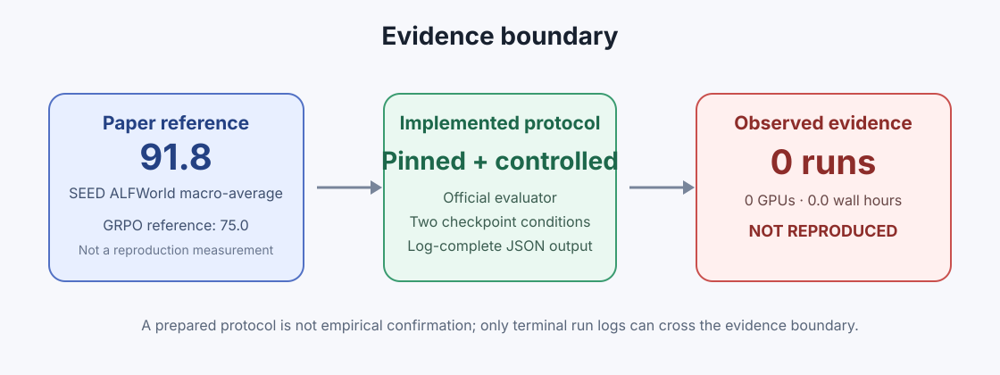
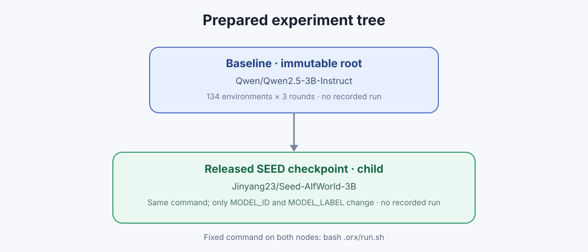

# SEED ALFWorld Checkpoint Reproduction

## Executive summary

This project attempted to reproduce the ALFWorld result from **SEED:
Self-Evolving On-Policy Distillation for Agentic Reinforcement Learning**
(arXiv:2607.14777). The authors report a 91.8 ALFWorld macro-average for SEED
with Qwen2.5-3B-Instruct, versus 75.0 for their matched GRPO control. We built a
public, pinned evaluation harness around the authors' code and released
checkpoint, but no training or evaluation run was recorded by OpenResearch.

**Verdict: not reproduced.** The experimental protocol is implementation-ready,
but there is no run log from which to calculate an observed success rate,
uncertainty interval, or comparison. The absence of evidence is reported as
such; paper values are never presented as reproduction measurements.



## What the paper claims

SEED addresses sparse outcome supervision in long-horizon agentic reinforcement
learning. A single evolving checkpoint serves two roles: it acts to collect
on-policy trajectories and analyzes completed trajectories into natural-language
hindsight skills. Sampled action tokens are re-scored with and without the skill
context. A detached skill-induced log-probability shift gates a dense
on-policy-distillation loss, which is optimized jointly with group-relative RL.
At deployment, the policy acts without a skill prompt.

The paper's main aggregate Qwen2.5-3B results include:

| Benchmark metric | GRPO | SEED | Reported gain |
|---|---:|---:|---:|
| ALFWorld macro-average success | 75.0 | 91.8 | +16.8 points |
| Search-QA average accuracy | 36.4 | 45.7 | +9.3 points |
| WebShop score | 79.8 | 88.5 | +8.7 points |
| WebShop success | 63.3 | 78.9 | +15.6 points |

These are **paper-reported reference values**, not outputs of this project.

## Reproduction question

The prepared first round asks a narrower, prerequisite question:

> Does the authors' released `Jinyang23/Seed-AlfWorld-3B` checkpoint recover its
> reported 91.8 ALFWorld result under the authors' own public evaluator, and how
> much does it improve over the untrained Qwen2.5-3B-Instruct backbone under the
> same protocol?

This round would validate checkpoint and evaluator fidelity. It would not, by
itself, establish the stronger causal claim that the SEED training objective
outperforms a matched 160-update GRPO run.

## Implemented protocol

The repository pins the authors' official SEED implementation at commit
`2cf2fadca3c5aba28da68e8e1405182ba8d90e6c`. The fixed command on both experiment
nodes is:

```bash
bash .orx/run.sh
```

The harness performs the following reproducible steps:

1. Print the full tracked configuration and visible GPU count.
2. Clone the official repository and detach at the pinned commit.
3. Install vLLM 0.11.0, ALFWorld, and the upstream package.
4. Download the configured Hugging Face checkpoint.
5. Run the official `local_vllm_alfworld.py` evaluator.
6. Print the complete result JSON between explicit evidence markers so the
   OpenResearch log contains aggregate and task-family metrics.

The frozen evaluation settings are:

| Setting | Value |
|---|---|
| Split | `eval_in_distribution` |
| Parallel environments | 134 |
| Evaluation rounds | 3 |
| Environment seed | 1 |
| Maximum steps | 30 |
| Prompt history | 5 observations |
| Temperature | 0.4 |
| Maximum completion tokens | 512 |
| Tensor parallel size | 1 |
| Data parallel size | 8 |
| vLLM GPU-memory utilization | 0.6 |

## Experiment tree and controlled difference



The OpenResearch tree contains two nodes:

| Experiment | ID | Branch | Checkpoint | Recorded runs |
|---|---|---|---|---:|
| Baseline | `cb57b5fb-b1ef-48d0-b0cc-1f8985d89c79` | `orx/baseline` | `Qwen/Qwen2.5-3B-Instruct` | 0 |
| Released SEED checkpoint | `872057f1-9e10-476c-a665-99d50c2cd54c` | `orx/released-seed-checkpoint` | `Jinyang23/Seed-AlfWorld-3B` | 0 |

The SEED child differs from the immutable root by only two values in the tracked
configuration: `MODEL_ID` and `MODEL_LABEL`. The command and environment
contract are identical.

## Evidence and result

OpenResearch local mode treats run logs as the evidence channel. At publication
time:

- `orx runs 221c9ea6-419d-4301-8e5d-b448fec6d2ed` returned **No runs found**.
- Neither experiment had a run ID or terminal log.
- No result JSON or trajectory output was produced.
- Maximum concurrently allocated GPUs: **16**.
- Actual compute wall time: **0.0 hours**.

The publication metadata records Kubernetes, NVIDIA RTX PRO 6000 Blackwell,
and `gpuCount: 16`: the maximum concurrent allocation assigned to this
reproduction on the 16-GPU cluster. No recorded run consumed measurable wall
time, so `wallHours: 0.0` is the actual elapsed compute time retained by the
project.

Because there is no observed metric, it is impossible to test agreement with
91.8, estimate variance across the three rounds, quantify the base-to-SEED gain,
or diagnose per-task-family behavior. The only defensible scientific verdict is
**not reproduced**.

## What was established

Although the empirical claim remains untested, the setup work established:

- the authors released both official code and a final ALFWorld checkpoint;
- the official evaluator exposes overall, category-macro, task-family,
  action-format, and API-error metrics;
- the evaluation can be expressed as a fixed-command, branch-controlled
  comparison with a two-line experimental diff;
- the final JSON can be emitted to stdout, closing the evidence gap that would
  otherwise exist in local OpenResearch mode;
- the first paired evaluation is structurally ready for eight GPUs per
  condition, if compute is authorized in future work.

## Limitations

1. **No empirical observation.** This dominates every other limitation.
2. **Released checkpoint versus base model.** The prepared comparison is not the
   paper's matched GRPO-versus-SEED training comparison.
3. **Missing public Stage-1 initialization.** The authors released the final
   SEED checkpoint, but this project did not locate a released hindsight-skill
   SFT initialization or GRPO checkpoint.
4. **No causal training test.** Reproducing the main claim requires constructing
   the published 1,440-trajectory Stage-1 dataset and training matched GRPO and
   SEED conditions from the same initialization.
5. **No uncertainty estimate.** The planned three evaluation rounds were never
   executed.

## Recommended continuation

Future work should proceed in two gated stages:

1. Run the prepared base and released-checkpoint evaluations concurrently on
   the same backend. Require complete evidence JSON, zero API-error rate, and
   stable task-family counts before accepting evaluator fidelity.
2. Only after that validation, reproduce Stage 1 and train matched GRPO and SEED
   conditions from the same SFT checkpoint. The training comparison—not the
   released-checkpoint evaluation—is the decisive test of the paper's causal
   claim.

## Public artifacts

- Reproduction harness: `.orx/run.sh`
- Tracked condition: `.orx/reproduction.conf`
- Machine-readable metadata: `autoresearch.json`
- Self-contained notebook: `notebooks/seed_reproduction.py`
- Molab: <https://molab.marimo.io/github/alphaXiv/seed-self-evolving-on-policy-distillation-for-ag/blob/main/notebooks/seed_reproduction.py>

## References

1. Wu et al., *SEED: Self-Evolving On-Policy Distillation for Agentic
   Reinforcement Learning*, arXiv:2607.14777, 2026.
2. Authors' implementation: <https://github.com/jinyangwu/SEED>.
3. Released checkpoint: <https://huggingface.co/Jinyang23/Seed-AlfWorld-3B>.
