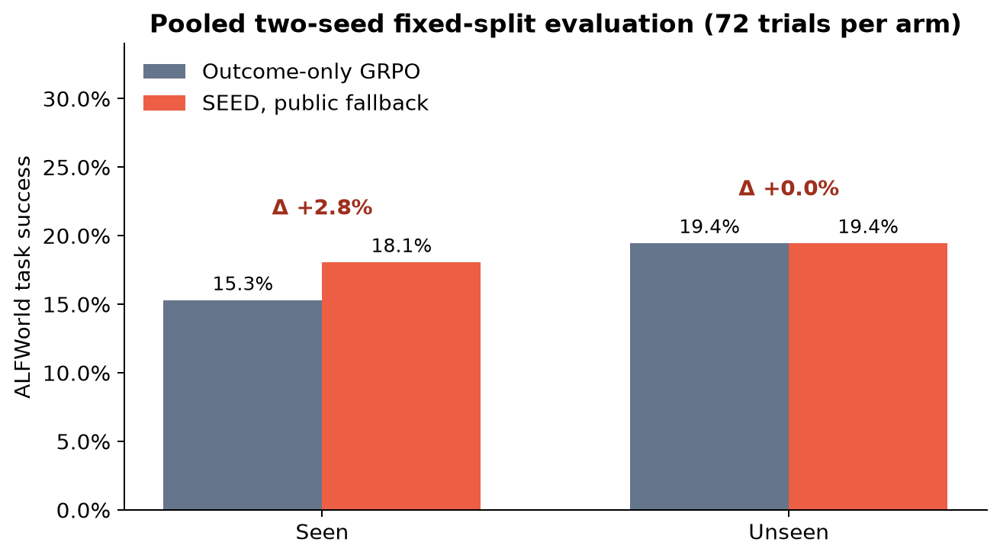
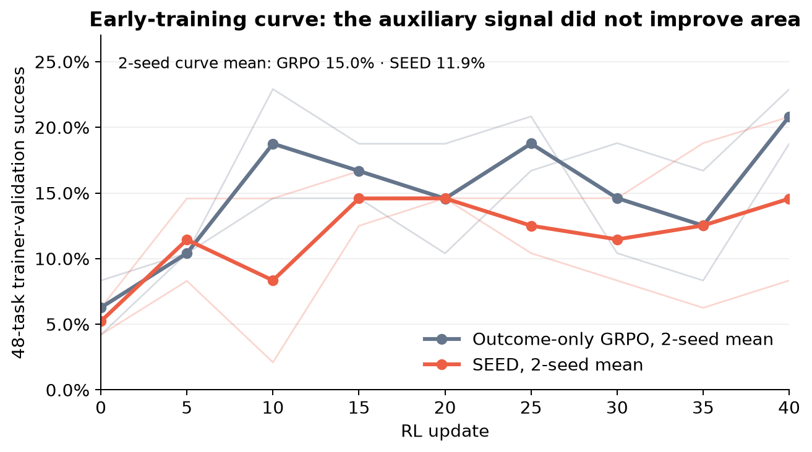

# SEED on bounded ALFWorld: a partial reproduction

**Assessment: partially reproduced.** Across two matched 40-update Qwen3-1.7B seeds, confidence-gated on-policy distillation raised pooled fixed seen-split success from 11/72 to 13/72 (+2.8 percentage points), but held-out success tied at 14/72 and the two-seed early-training curve favored outcome-only GRPO by 3.1 points. Seed 1 was positive on both endpoints; seed 2 was negative on both. The weak pooled seen direction agrees with the paper, while the held-out and early-efficiency claims are inconclusive or not aligned under this smaller public-analyzer reconstruction.

The [self-contained Molab notebook](https://molab.marimo.io/github/alphaXiv/seed-self-evolving-on-policy-distillation-for-ag/blob/main/notebooks/seed_reproduction.py) opens directly from the public repository with the measured evidence embedded.

## Central question

SEED asks whether an agent can turn hindsight about its own trajectories into dense token-level learning targets, instead of learning only from a sparse task outcome. The paper reports that this confidence-gated on-policy distillation raises Qwen2.5-3B ALFWorld success from 75.0% with outcome-only GRPO to 91.8% with SEED, improves the learning curve, and retains a +15.3-point advantage on unseen tasks.

This reproduction tests the causal comparison rather than only re-running the authors' final checkpoint: both arms start from the same Qwen3-1.7B base, use byte-identical public skill-SFT data, see the same bounded training and validation task manifests, and differ only in whether the online analyzer and OPD loss are enabled.

## What ran

| Item | Paper | Bounded reproduction |
|---|---:|---:|
| Base model | Qwen2.5-3B | Qwen3-1.7B |
| RL updates | 150 | 40 |
| Training batch / group | 16 / 8 | 16 / 4 |
| Fixed final evaluation | full reported benchmark | 36 seen + 36 unseen tasks |
| Maximum environment steps | 30 | 30 |
| OPD coefficient / gate beta | 0.01 / 5 | 0.01 / 5 |
| Analyzer | GLM-5.2 annotations | public Qwen3 policy + deterministic task-family fallback |
| Compute | 8 × A800 | Kubernetes; 8 GPUs per arm, 16 peak concurrent NVIDIA RTX PRO 6000 Blackwell GPUs |

The two outcome-only runs took **7,009 seconds (1.946944 h)** and **7,089 seconds (1.969167 h)**; the two SEED runs took **7,723 seconds (2.145278 h)** and **7,843 seconds (2.178611 h)**. Every arm ran on Kubernetes with 8 NVIDIA RTX PRO 6000 Blackwell GPUs. Matched arms overlapped, and the run history records **16 GPUs requested concurrently**. From the first successful Kubernetes run start to the last evidence log, the measured reproduction window was **7.330663 wall hours**.

## Implementation

The public harness pins the authors' implementation at commit `2cf2fadca3c5aba28da68e8e1405182ba8d90e6c`. The fixed command is `bash .orx/run.sh`; configuration changes live in committed files, never command-line variants.

The consequential code path is short:

1. `.orx/run.sh` installs the pinned SEED code and ALFWorld, prepares public data, runs the shared SFT phase, launches the selected RL arm, merges the final FSDP checkpoint, and prints both final evaluation JSON blocks into the terminal log.
2. `.orx/ensure_sft_data.py` makes Stage 1 reproducible when the public analyzer output is sparse or malformed. Twelve rollouts cover all six ALFWorld task families; only 1/12 analyzer responses parsed, so deterministic task-family skills produced a balanced 48-row SFT set.
3. `.orx/patch_online_analyzer.py` applies the same documented fallback online. In the primary SEED arm, every update yielded 64/64 usable episode analyses instead of silently disabling the auxiliary signal.
4. `.orx/training.conf` selects `METHOD=seed`, `OPD_LOSS_COEF=0.01`, and 40 updates. The GRPO child changes the method and disables analysis/OPD while inheriting every other setting.

The SFT artifact was identical across the causal arms: the train parquet SHA-256 was `b143c4af9fb5b71c76bbbd5c814ee85cebd2746355573db55fbcf4b723f8367f`, and validation was `8c485d485d01feaa8ef0f0f87574b18d7a9775cccd96f5716df423f11b1d0fd1`. Four SFT steps reduced training loss from 5.033 to 3.988; validation loss was 3.900.

The SEED run exercised a real auxiliary path. At update 38, for example, it formed 1,767 teacher-token targets, the OPD active-token ratio was 0.610, the confidence-gate active ratio was 0.331, and OPD loss was 0.024 at coefficient 0.01. The matched GRPO log reports all corresponding teacher and OPD metrics as zero.

## Results

### Claim 1: seen ALFWorld success

| Evidence | Outcome-only GRPO | SEED | Difference | Assessment |
|---|---:|---:|---:|---|
| Paper, Qwen2.5-3B | 75.0% | 91.8% | +16.8 pt | paper reference |
| Seed 1 fixed seen tasks | 13.9% (5/36) | 22.2% (8/36) | +8.3 pt | aligned direction |
| Seed 2 fixed seen tasks | 16.7% (6/36) | 13.9% (5/36) | −2.8 pt | not aligned in this seed |
| **Pooled two-seed seen** | **15.3% (11/72)** | **18.1% (13/72)** | **+2.8 pt** | **weak direction; partial** |

The first seed showed roughly half the paper's gain, but the second reversed it. Pooling counts leaves only a 2.8-point seen advantage. With two seeds and 72 task trials per arm, this is a small descriptive direction, not a precise population estimate.

### Claim 2: early sample efficiency

The paper's SEED curve is higher throughout its reported training fractions. Here, the two-seed mean of each arm's trapezoidal 48-task validation curve was **15.0% for GRPO and 11.9% for SEED** (−3.1 points). The seed-wise differences were −2.2 and −3.9 points. Under this bounded setup, the early-efficiency claim is **not aligned**.

These validation points use temperature 0.4 and are noisy; the fixed final task manifests below are the stronger endpoint evidence.

### Claim 3: held-out ALFWorld split

| Evidence | Outcome-only GRPO | SEED | Difference | Assessment |
|---|---:|---:|---:|---|
| Paper unseen split | 70.9% | 86.2% | +15.3 pt | paper reference |
| Seed 1 fixed unseen tasks | 19.4% (7/36) | 25.0% (9/36) | +5.6 pt | aligned direction |
| Seed 2 fixed unseen tasks | 19.4% (7/36) | 13.9% (5/36) | −5.6 pt | not aligned in this seed |
| **Pooled two-seed unseen** | **19.4% (14/72)** | **19.4% (14/72)** | **0.0 pt** | **inconclusive under this setup** |

The positive held-out effect did not survive the second seed; pooled counts are exactly tied. This bounded reconstruction therefore does not show a retained held-out advantage. That divergence is evidence about the specified Qwen3-1.7B/public-analyzer substitution, not a judgment on the original GLM-annotated 150-update experiment.

## Sensitivity checks

Two completed variations probe whether the endpoint result depends on the auxiliary weight or on how malformed public-analyzer prose is converted to a skill.

| Matched comparison | Seen success | Unseen success | Mean validation success | Interpretation |
|---|---:|---:|---:|---|
| Outcome-only GRPO, 20 updates | 16.7% (6/36) | 16.7% (6/36) | 7.5% | matched short control |
| SEED λ=0.001, 20 updates | 22.2% (8/36) | 19.4% (7/36) | 8.8% | +5.6 pt seen, +2.8 pt unseen, +1.3 pt curve mean |
| Outcome-only GRPO, 40 updates | 13.9% (5/36) | 19.4% (7/36) | 14.5% | primary control |
| SEED deterministic fallback, 40 updates | 22.2% (8/36) | 25.0% (9/36) | 12.3% | strongest fixed endpoint |
| Outcome-only GRPO, seed 2 | 16.7% (6/36) | 19.4% (7/36) | 15.5% | robustness control |
| SEED deterministic fallback, seed 2 | 13.9% (5/36) | 13.9% (5/36) | 11.6% | endpoint direction reversed |
| SEED raw-hindsight fallback, 40 updates | 16.7% (6/36) | 16.7% (6/36) | 9.7% | weaker than the structured fallback |

At 20 updates, the lower λ=0.001 signal improved both fixed endpoints and the mean validation curve over its matched outcome-only control. This is supportive but based on one short seed. At 40 updates, preserving the final 96 words of malformed Qwen3 hindsight produced only 6/36 successes on each split, versus 8/36 seen and 9/36 unseen for the concise deterministic task-family fallback. The raw arm still exercised OPD: at update 40, 1,773 teacher tokens were formed, 60/64 analyses used the raw fallback, 60.4% of response tokens were active, and 29.0% passed the confidence gate. The difference therefore reflects analyzer content rather than an accidentally disabled loss.

## Evaluator fidelity check

Before causal training, the same official ALFWorld evaluator compared the authors' released `Jinyang23/Seed-AlfWorld-3B` checkpoint with `Qwen/Qwen2.5-3B-Instruct`. Category-macro success was **89.3%** for the released checkpoint versus **15.8%** for base. The released result is 2.5 points below the paper's 91.8%, supporting evaluator fidelity while leaving normal decoding and subset variance. These were successful Kubernetes runs lasting 6m40s and 8m46s on 8 GPUs each.

## Evidence boundaries

- The analyzer substitution is the largest fidelity gap. The public Qwen3 model usually emitted useful prose that did not satisfy the released JSON parser; deterministic task-family skills are less specific than the paper's GLM-5.2 hindsight.
- The experiment uses 40 rather than 150 updates, group size 4 rather than 8, 16 bounded training tasks, two full causal seeds, and 36 tasks per final split per seed.
- Qwen3-1.7B is the requested smaller model; the paper's headline ALFWorld result uses Qwen2.5-3B.
- Final checkpoints were evaluated inside their supervised Kubernetes jobs and the complete result JSON was preserved in OpenResearch terminal logs. No claim is made that the ephemeral training checkpoint itself was published.
- All plotted values are transcribed in `data/results.json`; `plot_results.py` regenerates the figures. The source run identifiers remain in experiment descriptions and the data provenance block.

## Assessment

The reproduction is **partial**. The pooled seen endpoint retains a small +2.8-point SEED direction, and the lower-λ short run improved its matched endpoints and curve mean. However, seed 2 reversed both full-run endpoint effects, pooled held-out success tied exactly, both full seeds had worse early-curve area, and raw public-analyzer hindsight was weaker than the structured fallback. A full-scale reproduction still needs the original analyzer prompts/model (or a validated equivalent), Qwen2.5-3B, 150 updates, group size 8, broader task coverage, and more seeds.

Relevant branches: [matched GRPO control](https://github.com/alphaXiv/seed-self-evolving-on-policy-distillation-for-ag/tree/orx/outcome-only-grpo-with-validated-sft-shard), [primary deterministic-fallback SEED](https://github.com/alphaXiv/seed-self-evolving-on-policy-distillation-for-ag/tree/orx/seed-opd-with-deterministic-online-analyzer-fall), [seed-2 GRPO](https://github.com/alphaXiv/seed-self-evolving-on-policy-distillation-for-ag/tree/orx/outcome-only-grpo-seed-260714778), [seed-2 SEED](https://github.com/alphaXiv/seed-self-evolving-on-policy-distillation-for-ag/tree/orx/seed-deterministic-analyzer-seed-260714778), [20-update GRPO control](https://github.com/alphaXiv/seed-self-evolving-on-policy-distillation-for-ag/tree/orx/outcome-only-grpo-20-update-endpoint), [λ=0.001 sensitivity](https://github.com/alphaXiv/seed-self-evolving-on-policy-distillation-for-ag/tree/orx/seed-opd-lambda-0-001-sensitivity), [raw-hindsight sensitivity](https://github.com/alphaXiv/seed-self-evolving-on-policy-distillation-for-ag/tree/orx/seed-raw-hindsight-with-regex-import), [released-checkpoint evaluator](https://github.com/alphaXiv/seed-self-evolving-on-policy-distillation-for-ag/tree/orx/released-seed-checkpoint), and [base-checkpoint evaluator](https://github.com/alphaXiv/seed-self-evolving-on-policy-distillation-for-ag/tree/orx/base-checkpoint-kubernetes-evaluation).

Sources: [paper (arXiv:2607.14777)](https://arxiv.org/abs/2607.14777), [authors' code](https://github.com/jinyangwu/SEED), and [released checkpoint](https://huggingface.co/Jinyang23/Seed-AlfWorld-3B).
